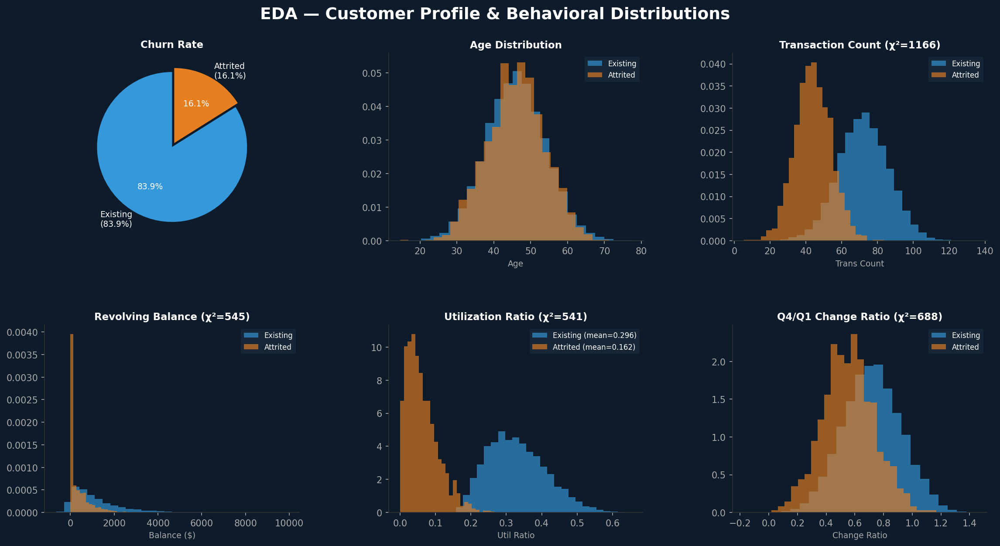
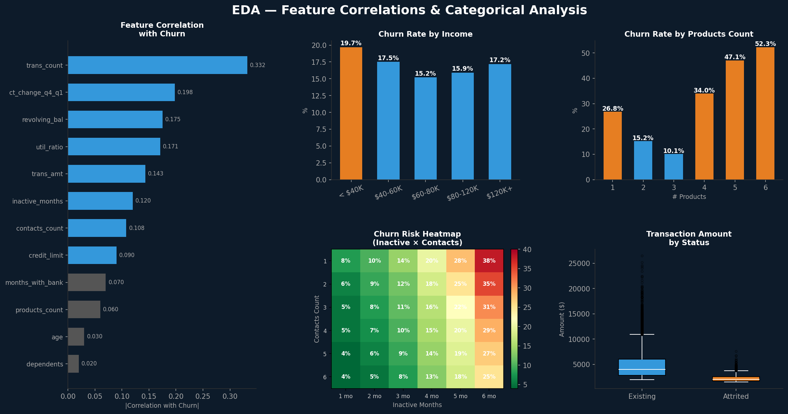
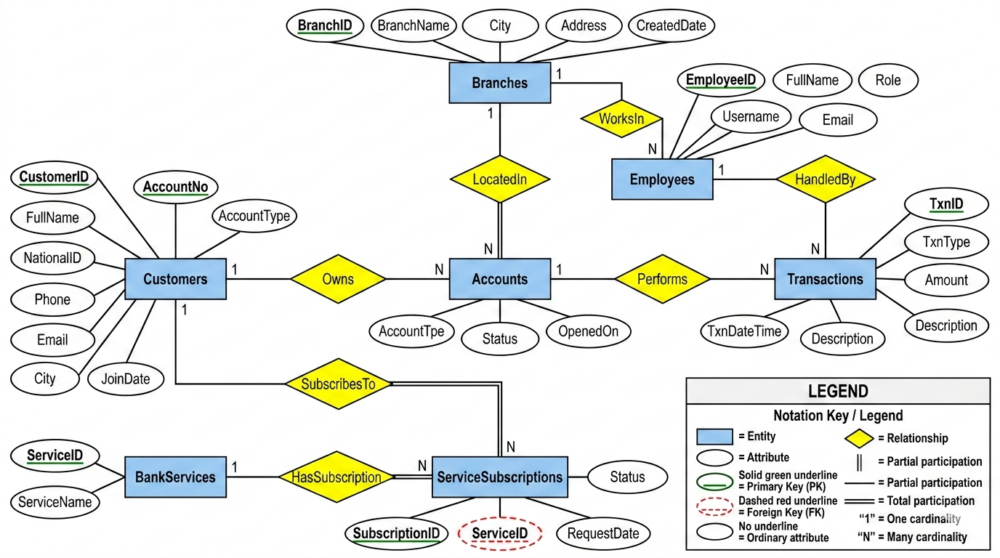
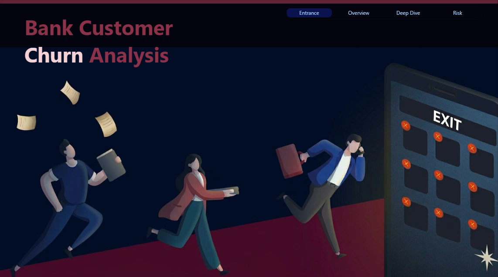

# 🏦 Bank Customer Churn Prediction — Data Analytics & Machine Learning


## 📌 Project Overview

An end-to-end **Bank Customer Churn Prediction and Analytics** project developed as part of a larger **Bank Management System**.

The project combines **data cleaning, exploratory data analysis, machine learning, data mining, SQL Server, and Power BI** to analyze customer behavior and identify customers who are at higher risk of leaving the bank.

The complete system follows a four-stage workflow:

**SQL Server → Orange Data Mining → Python / Google Colab → Power BI**

This repository includes the full pipeline: the **relational database design**, the **Orange data-mining workflow**, the **Python-based analytics and machine learning pipeline**, and the **Power BI dashboard**.

---

## 🎯 Business Objective

Customer churn is a major challenge for banks because losing existing customers can directly affect revenue and long-term customer value.

The main objective of this project is to:

* Identify customers at risk of churn.
* Understand the behavioral factors associated with attrition.
* Build machine learning models for churn prediction.
* Compare multiple classification algorithms.
* Reduce missed churners using recall-focused model tuning.
* Translate analytical findings into actionable customer-retention recommendations.
* Support decision-making through Power BI dashboards.

---

## 📊 Dataset

The project uses a bank credit-card customer dataset containing demographic, financial, and behavioral information.

### Dataset after cleaning

* **Rows:** 10,226
* **Columns:** 21
* **Target:** `status`
* **Existing Customer:** `0`
* **Attrited Customer:** `1`
* **Existing Customers:** 83.9%
* **Attrited Customers:** 16.1%

The dataset contains information related to:

* Customer demographics
* Credit limits
* Transaction behavior
* Product usage
* Inactivity
* Revolving balance
* Customer contacts
* Spending behavior

---

# 1️⃣ Data Cleaning & Preparation

The data preparation stage focused on improving data quality before analysis and modeling.

### Missing Values

| Feature     | Missing Values | Percentage | Treatment |
| ----------- | -------------: | ---------: | --------- |
| `education` |          1,532 |        15% | `Unknown` |
| `income`    |          1,125 |        11% | `Unknown` |
| `marital`   |            752 |         7% | `Unknown` |

Categorical variables with meaningful missing information were assigned an explicit `Unknown` category.

Numeric variables were handled according to their distribution:

* Median imputation for highly skewed variables.
* Mean imputation for approximately normally distributed variables.

Columns with excessive missingness were considered for removal.

### Additional Cleaning

The following steps were also performed:

* Removed duplicate rows.
* Verified `client_id` uniqueness.
* Removed `client_id` from the modeling features.
* Removed redundant features.
* Converted variables into appropriate data types.
* Encoded the target variable into binary values.

---

# 2️⃣ Exploratory Data Analysis

EDA was performed to understand customer characteristics and identify behavioral patterns associated with churn.

## Customer Profile & Behavioral Distributions



## Feature Correlations & Categorical Analysis



### 🔎 Key Findings

#### 1. Transaction behavior is a major churn signal

`trans_count` and `trans_amt` showed some of the strongest differences between existing and attrited customers.

Customers who churned generally demonstrated:

* Lower transaction frequency.
* Lower transaction amounts.
* Reduced engagement with their credit card.

#### 2. Revolving balance and utilization

`revolving_bal` and `util_ratio` showed strong behavioral differences between customer groups.

A reduction toward zero can indicate that customers are becoming less engaged with the card before leaving.

#### 3. Number of products

`products_count` showed a noticeable separation between churned and existing customers.

Customers with fewer products tended to show higher churn risk.

#### 4. Highly correlated variables

`credit_limit` and `open_to_buy` were perfectly correlated:

**Correlation = 1.00**

Therefore, `open_to_buy` was removed to reduce feature redundancy.

---

# 3️⃣ Machine Learning Pipeline

The machine learning pipeline was designed to handle categorical variables, skewed numerical features, and class imbalance.

### Pipeline

```text
Raw Dataset
     ↓
Data Cleaning
     ↓
Remove Identifier / Redundant Features
     ↓
Target Encoding
     ↓
Categorical Encoding
     ↓
Feature Engineering
     ↓
Log Transformation
     ↓
Train / Test Split
     ↓
Standard Scaling
     ↓
SMOTE
     ↓
Model Training
     ↓
Model Evaluation
     ↓
Hyperparameter Tuning
```

### Train/Test Split

A stratified **75/25 split** was used.

```text
Training Set: 7,595 rows
Test Set:     2,532 rows
```

The test set remained untouched and imbalanced to provide a more realistic evaluation of model performance.

---

## ⚖️ Handling Class Imbalance with SMOTE

The original dataset contained considerably fewer churned customers.

### Before SMOTE

| Class     | Customers |
| --------- | --------: |
| Existing  |     6,375 |
| Attrited  |     1,220 |
| **Total** | **7,595** |

### After SMOTE

| Class     |  Customers |
| --------- | ---------: |
| Existing  |      6,375 |
| Attrited  |      6,375 |
| **Total** | **12,750** |

SMOTE was applied **only to the training data** to avoid contaminating the test set.

---

# 4️⃣ Model Benchmarking

Five classification algorithms were trained and evaluated:

* Logistic Regression
* Decision Tree
* Random Forest
* XGBoost
* LightGBM

The models were evaluated using:

* Accuracy
* Precision
* Recall
* F1-score
* ROC-AUC
* Average Precision
* False Negatives

For a churn prediction problem, **Recall and False Negatives are particularly important**, because missing a customer who is likely to churn can result in a lost retention opportunity.

---

## 📈 Model Performance

| Model                 |   Accuracy |  Precision |     Recall |         F1 |    ROC-AUC | Avg Precision |     FN |
| --------------------- | ---------: | ---------: | ---------: | ---------: | ---------: | ------------: | -----: |
| Logistic Regression   |     0.8839 |     0.6195 |     0.7199 |     0.6659 |     0.9155 |        0.7163 |    114 |
| Decision Tree         |     0.9155 |     0.7198 |     0.7764 |     0.7470 |     0.8593 |        0.5948 |     91 |
| Random Forest         |     0.9518 |     0.8626 |     0.8329 |     0.8475 |     0.9843 |        0.9265 |     68 |
| XGBoost               |     0.9648 |     0.9098 |     0.8673 |     0.8881 |     0.9918 |        0.9612 |     54 |
| LightGBM              |     0.9696 |     0.9188 |     0.8894 |     0.9039 |     0.9912 |        0.9608 |     45 |
| **LightGBM Tuned 🏆** | **0.9613** | **0.8687** | **0.8943** | **0.8814** | **0.9889** |    **0.9470** | **43** |

---

# 🏆 5️⃣ LightGBM Hyperparameter Tuning

LightGBM was selected for further optimization because of its strong performance during benchmarking.

`RandomizedSearchCV` was used with:

```text
50 candidates
5-fold cross-validation
Optimization metric: Recall
```

### Best Parameters

```python
{
    'subsample': 0.8,
    'num_leaves': 70,
    'n_estimators': 300,
    'min_child_samples': 10,
    'max_depth': 10,
    'learning_rate': 0.01,
    'colsample_bytree': 0.6
}
```

### Best Cross-Validation Recall

```text
0.9691
```

The tuned LightGBM model reduced false negatives from:

```text
Logistic Regression → 114 FN
LightGBM → 45 FN
Tuned LightGBM → 43 FN
```

The tuned model was selected as the **production candidate** because the primary business objective was to minimize missed churners.

This represents a deliberate **precision-recall trade-off**, rather than an improvement across every individual metric.

---

# 🔍 6️⃣ Top Predictive Features

The tuned LightGBM model identified the following features as the strongest predictors:

| Rank | Feature                | Importance |
| ---: | ---------------------- | ---------: |
|    1 | `trans_amt_log`        |      3,232 |
|    2 | `trans_count`          |      2,055 |
|    3 | `amt_change_q4_q1_log` |      2,028 |
|    4 | `products_count`       |      1,853 |
|    5 | `inactive_months`      |      1,492 |
|    6 | `revolving_bal`        |      1,486 |
|    7 | `ct_change_q4_q1_log`  |      1,439 |
|    8 | `contacts_count`       |      1,382 |
|    9 | `age`                  |      1,185 |
|   10 | `credit_limit_log`     |      1,107 |

### Main Insight

The model strongly emphasizes **customer engagement and transaction behavior**.

In particular:

```text
Transaction Amount
        ↓
Transaction Frequency
        ↓
Change in Spending
        ↓
Number of Products
        ↓
Inactivity
        ↓
Revolving Balance
```

These variables provide valuable signals for identifying customers who may be moving toward churn.

---

# 💼 7️⃣ Business Recommendations

Based on the EDA and machine learning results, several retention strategies can be considered.

### 1. Monitor low transaction activity

Customers with fewer than approximately **40 transactions per year** can be considered for early retention campaigns.

### 2. Monitor decreasing revolving balance

A significant decrease in `revolving_bal`, particularly toward zero, may indicate reduced card engagement.

### 3. Cross-sell relevant products

Customers using only one or two products could be targeted with personalized cross-selling campaigns.

### 4. Investigate frequent customer contacts

Customers with **5+ contacts within 12 months** may require additional attention because repeated interactions can indicate dissatisfaction or unresolved issues.

### 5. Re-engage inactive customers

Customers with **3+ inactive months** can be targeted with personalized offers or engagement campaigns.

---

# 🧩 8️⃣ Full Bank Management System

This machine learning pipeline is one component of a larger team-based **Bank Management System**.

The complete project integrates:

```text
SQL Server
     ↓
Orange Data Mining
     ↓
Python / Google Colab
     ↓
Power BI
```

---

## 🗄️ SQL Server

The database layer includes:

* 7 normalized tables.
* Primary and foreign keys.
* Referential integrity.
* IDENTITY primary keys.
* Analytical SQL queries.
* Customer statements.
* Branch performance analysis.
* Dormant account analysis.
* AML transaction monitoring.

An AML rule based on:

```text
AVG + 3 × STDEV
```

was used to identify suspicious transactions.

The system flagged three seeded suspicious transactions:

```text
95K EGP
88K EGP
75K EGP
```

### 📐 Entity-Relationship Diagram



The schema is built around **7 core entities**:

* **Customers** — demographic and contact details.
* **Accounts** — owned by customers (`Owns`), one customer can hold multiple accounts.
* **Branches** — physical locations, each hosting multiple accounts (`LocatedIn`) and employees (`WorksIn`).
* **Employees** — bank staff who handle transactions (`HandledBy`).
* **Transactions** — performed on accounts (`Performs`), each handled by one employee.
* **BankServices** — the catalog of services offered by the bank.
* **ServiceSubscriptions** — a many-to-many bridge (`HasSubscription`) linking customers to the services they subscribe to (`SubscribesTo`), carrying its own `Status` and `RequestDate`.

Primary keys are underlined in solid green, foreign keys in dashed red, and relationship cardinalities (`1`/`N`) are marked on each connecting line, following the legend included in the diagram.

---

## 🧠 Orange Data Mining

A parallel data-mining workflow ([`churn_prediction_workflow.ows`](orange/churn_prediction_workflow.ows)) was developed using **Orange**, covering data preparation, exploration, and model comparison in a visual, no-code pipeline.

### Workflow Structure

```text
Data Preparation
  File → Select Columns → Impute → Unique → Data Table
     └── Data Info · Column Statistics

Exploration
  Distributions · Rank · Box Plot · Scatter Plot

Modeling & Evaluation
  Test and Score
     ├── Naive Bayes
     ├── SVM
     ├── kNN
     └── Neural Network
  → Confusion Matrix · ROC Analysis

Output
  Save Data → Data Table · Column Statistics
```

The best-performing model was:

**Neural Network**

Performance:

```text
AUC = 0.969
CA  = 93.8%
MCC = 0.764
```

The model detected approximately **77.6% of churners** at a **3.1% false-positive rate**.

The strongest feature was:

```text
Total_Trans_Ct
```

This finding is consistent with the Python analysis, where transaction behavior was among the strongest predictors.

---

## 📊 Power BI

The Power BI dashboard ([`Bank_Churn_Dashboard.pbix`](powerbi/Bank_Churn_Dashboard.pbix)) provides an interactive business view of customer churn.

It includes:

* Customer KPIs.
* Churn rate.
* Average transaction metrics.
* Churn analysis by products.
* Churn analysis by age.
* Churn analysis by education.
* Churn analysis by gender.
* Inactivity analysis.
* Contact-count risk analysis.
* Interactive slicers.



> Open [`powerbi/Bank_Churn_Dashboard.pbix`](powerbi/Bank_Churn_Dashboard.pbix) in Power BI Desktop to explore the interactive report and slicers.

---

# 🗺️ 9️⃣ System Architecture

```text
                    BANK MANAGEMENT SYSTEM
                              │
             ┌────────────────┼────────────────┐
             │                │                │
             ▼                ▼                ▼
        SQL Server        Data Mining       Analytics
             │             (Orange)         (Python)
             │                │                │
             └────────────────┼────────────────┘
                              │
                              ▼
                          Power BI
                              │
                              ▼
                    Business Insights
                              │
                              ▼
                     Customer Retention
```

---

# 📁 🔟 Repository Structure

```text
bank-customer-churn-prediction/
│
├── README.md
│
├── customer_churn_pipeline.ipynb
││
├── orange/
│   └── churn_prediction_workflow.ows
│
├── powerbi/
│   └── Bank_Churn_Dashboard.pbix
│
└── assets/
    ├── eda_distributions.png
    ├── eda_correlations.png
    ├── erd_diagram.png
    └── powerbi_dashboard_cover.png
```

---

# ⚠️ 1️⃣1️⃣ Limitations

The project has several limitations:

* The dataset represents a single time period.
* Customer behavior may change over time.
* Competitor activity is not included.
* Macroeconomic factors are not included.
* Customer lifetime value was not incorporated into the optimization objective.
* Recall was prioritized for model tuning because of the retention use case.

---

# 🚀 1️⃣2️⃣ Future Improvements

Potential future improvements include:

* Time-based churn modeling.
* Customer Lifetime Value integration.
* Cost-sensitive learning.
* Probability calibration.
* Threshold optimization based on retention campaign cost.
* SHAP-based model explainability.
* Automated model retraining.
* Deployment through an API.
* Real-time churn monitoring.
* Integration with CRM systems.
* Automated Power BI refresh.

---

# 🛠️ 1️⃣3️⃣ Technologies Used

| Category              | Technologies                    |
| --------------------- | -------------------------------- |
| Programming           | Python                          |
| Data Analysis         | Pandas, NumPy                   |
| Visualization         | Matplotlib, Seaborn             |
| Machine Learning      | Scikit-learn                    |
| Gradient Boosting     | XGBoost, LightGBM               |
| Imbalanced Learning   | SMOTE / imbalanced-learn        |
| Database              | SQL Server                      |
| Data Mining           | Orange Data Mining              |
| Business Intelligence | Power BI                        |
| Development           | Google Colab / Jupyter Notebook |

---


Then run the notebook from top to bottom.

To explore the other components:

* Open [`orange/churn_prediction_workflow.ows`](orange/churn_prediction_workflow.ows) in **Orange Data Mining**.
* Open [`powerbi/Bank_Churn_Dashboard.pbix`](powerbi/Bank_Churn_Dashboard.pbix) in **Power BI Desktop**.

---

# 📌 Key Takeaway

This project demonstrates a complete **data analytics and machine learning workflow** for customer churn:

```text
Data Cleaning
      ↓
EDA
      ↓
Feature Engineering
      ↓
Class Balancing
      ↓
Machine Learning
      ↓
Model Evaluation
      ↓
Hyperparameter Tuning
      ↓
Business Insights
      ↓
Customer Retention Strategy
```

The analysis shows that **customer transaction behavior, engagement, inactivity, and product usage** are among the most important signals associated with churn.

The final tuned LightGBM model achieved:

**89.43% Recall**

while reducing missed churners to:

**43 False Negatives**

making it a strong candidate for a retention-focused churn prediction workflow.

---

# 📄 License

This project is licensed under the **MIT License**.
